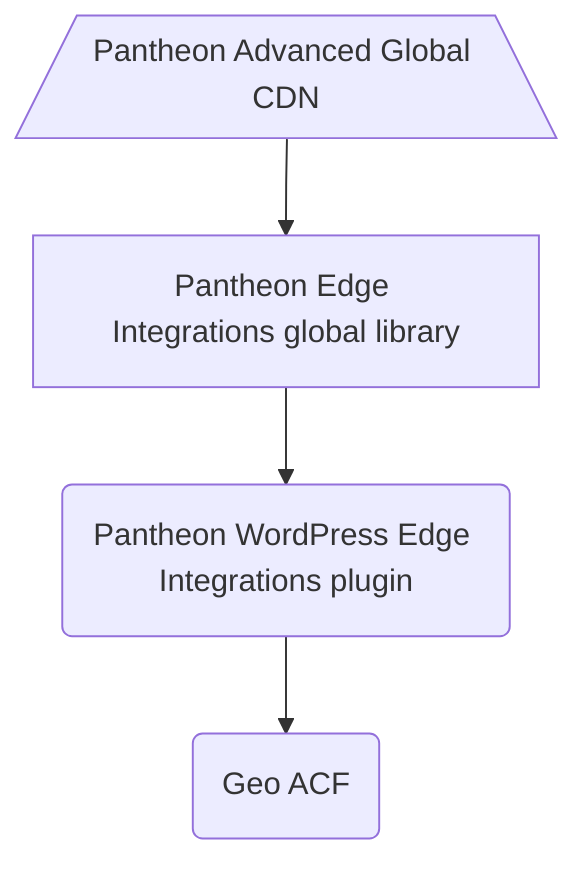

# Geo ACF

Stable tag: 1.0  
Requires at least: 5.8  
Tested up to: 5.9  
Requires PHP: 7.4  
License: MIT  
Tags: pantheon, personalization, edge integrations, geolocation, geoip, vcl, developer, advanced custom fields, acf
Contributors: jazzs3quence, jspellman, getpantheon

Example WordPress plugin which uses [Advanced Custom Fields](https://wordpress.org/plugins/advanced-custom-fields/) to manage and render location-based content to visitors on a site using Pantheon Edge Integrations personalization features.

## Description

This plugin registers a field group named `ACF Geo` on Posts and Pages. The field group contains:

- Default content field: content that is rendered on the frontend if no location is set.
- US content field: content that is rendered on the frontend if a visitor is US-based.
- CA content field: content that is rendered on the frontend if a visitor is CA-based.
- FR content field: content that is rendered on the frontend if a visitor is FR-based.

The `render_the_geo_content` function hooks into `the_content` filter and appends any location-specific content. The visitor's location is determined using the [`get_geo` function](https://github.com/pantheon-systems/pantheon-wordpress-edge-integrations/blob/main/inc/geo.php#L25).

## Architecture

The diagram below illustrates the how this plugin fits in with Pantheon's Edge Integrations WordPress solution.

